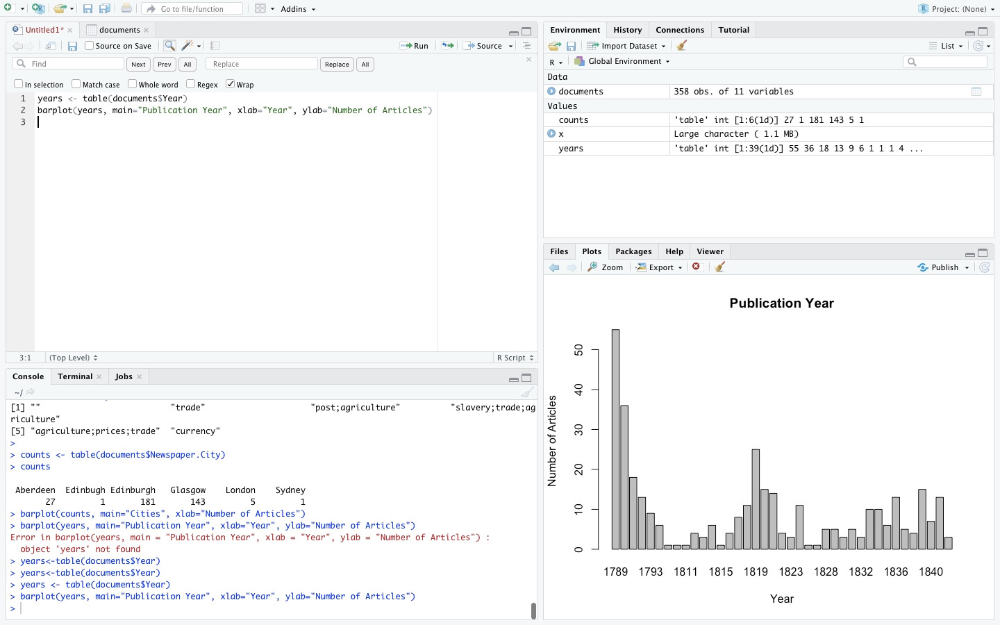

# DIGH 3814: Week 2 Coursework
## Excel
1. As instructed, I downloaded the data from the Canadian 2016 Census.
2. In Excel, I was able to import this csv and it presented a table of data.
3. I refined the data in the table by filtering for the Ontario side of the Ottawa-Gatineau census metropolitan area.
4. I found column D, 'GEO_NAME', clicked on it, unchecked the 'select all' box and then checked the box for the Ontario side of Ottawa-Gatineau.
5. The next step was to write a formula to find the sum of female children ages 1-4, first I had to find where this data began which was in Row 15500.
6.  In Row 15500, I then inserted the given formula which is =sum() and highlighted the 4 cells that held the data for female children ages 1-4.
7. The range, 20780, appeared between the parentheses and I was then able to create a chart after highlighting the two columns.

## Intro to R
1. The first thing I did was download RStudio from the Anaconda Navigator interface.
2. After RStudio installed, I opened R Script.
3. In R Script, I copied the first code, install.packages("RCurl"), and successfully ran it.
4. Then, I copied the second code, library("RCurl"), which also ran without issues.
5. Following instructions, I then copied the code given to access the table of historical data.
6. Then, I copied "x" into the console and the text popped up moments later.
7. In order to see the table, I copied "View(documents)" into the console. At first, I received an error message but I quickly realized it was because I had not capitalized the v in "View".
8. In order to count the number of documents by the city which they were published in, I copied the given codes, counts <- table(documents$Newspaper.City) and counts into RScript and evidently, the counts appeared in the console.
9. I then plotted the counts on a bar graph by copying the given code, barplot(counts, main="Cities", xlab="Number of Articles")
10. As expected, the plot appeared in the bottom right pane of RStudio.
11. Note: I noticed the axis titles of the plot were wrong as the x-axis should read "Cities" (or something along those lines) and the y-axis should read "Number of Articles".
12. Then, I copied the given codes, years <- table(documents$Year)
 and barplot(years, main="Publication Year", xlab="Year", ylab="Number of Articles") to find the number of articles published each year.
 13. As expected, a graph titled "Publication Year" showed up in the bottom right pane.

 
