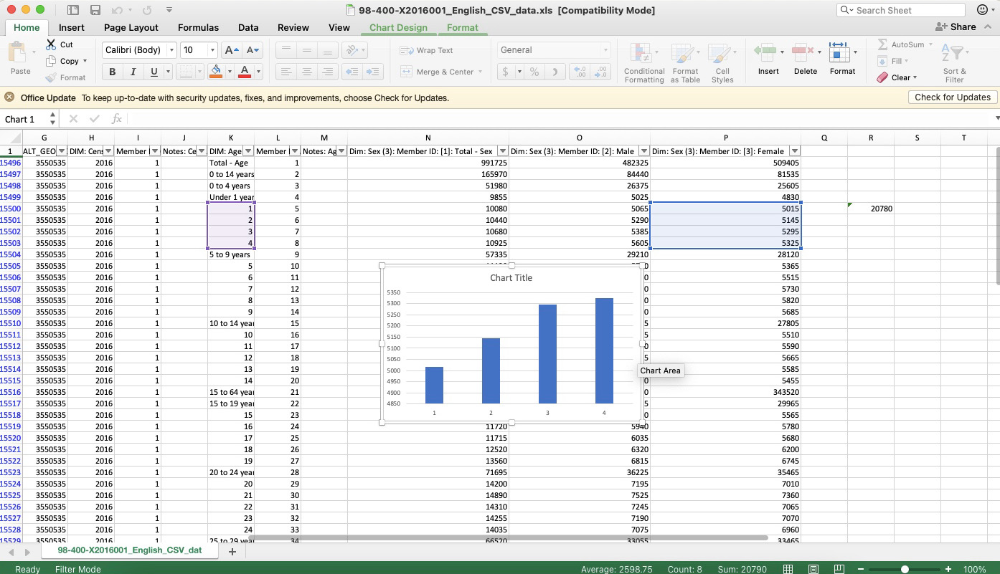

# DIGH 3814: Week 2 Coursework
## Excel and Intro to R
1. As instructed, I downloaded the data from the Canadian 2016 Census.
2. In Excel, I was able to import this csv and it presented a table of data.
3. I refined the data in the table by filtering for the Ontario side of the Ottawa-Gatineau census metropolitan area.
4. I found column D, 'GEO_NAME', clicked on it, unchecked the 'select all' box and then checked the box for the Ontario side of Ottawa-Gatineau.
5. The next step was to write a formula to find the sum of female children ages 1-4, first I had to find where this data began which was in Row 15500.
6.  In Row 15500, I then inserted the given formula which is =sum() and highlighted the 4 cells that held the data for female children ages 1-4.
7. The range, 20780, appeared between the parentheses and I was then able to create a chart after highlighting the two columns.

